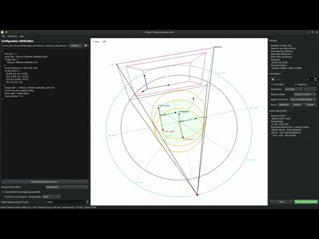
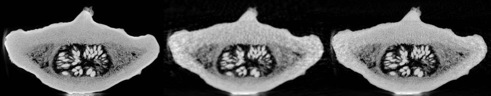
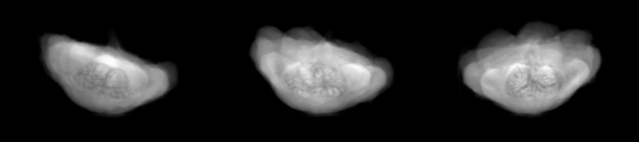

# 3D Cone-Beam CT Reconstruction

This repository contains a python tool for 3D Cone-Beam CT (CBCT) reconstruction, with a tiny example data set.


### Video Tutorial

For a visual walkthrough of the project and reconstruction process, watch the video tutorial:

[](https://www.youtube.com/watch?v=znY13qPe3qA)


## Project Structure & Reference Data

- **`ct_recon_fdk_astra/`**: Main package directory:
  - **`reconstruct.py`**: Python script for performing Feldkamp-Davis-Kress (FDK) cone-beam reconstruction using the ASTRA toolbox.
  - **`recon_coverage.py`**: Estimates useful reconstruction volumes from a CT trajectory.
  - **`data/example_data/`**: Package data directory containing the scan data and metadata:
    - **`pumpkin_3D_voxels_u8.nrrd`**: The 3D reference scan of a green pumpkin.
    - **`fullscan_<N>views_<W>x<H>.zip`**: Zip archive containing projection data.
    - **`*.ompl`**: Projection geometry matrices for the FD-CT views.
    - **`*.json`**: Config file containing settings for reconstructing the example data.


## Visualizations

### Reconstructed CT Volume Slice 172

Comparison at slice 172 along the Z-axis of the reference volume (`pumpkin_3D_voxels_u8.nrrd`), the 90-view reconstruction, and the 180-view reconstruction:



### Raw X-ray Projection Data

Three projection views (at indices 0, 15, and 30) from the 90-view raw projection stack (`fullscan_90views_600x400.nrrd`), resized to half resolution:




## Getting Started

### Prerequisites
This project requires a CUDA-enabled GPU for GPU-accelerated reconstruction via the ASTRA Toolbox.

For the **ASTRA Toolbox** (CUDA-enabled), refer to the official [ASTRA Toolbox Installation Guide](https://www.astra-toolbox.com/docs/install.html).

> [!NOTE]
> The core reconstruction command-line script `ct_recon_fdk_astra/reconstruct.py` works independently and **does not require** any graphical/Qt dependencies. If you only want to perform headless reconstructions, install without extras:
> ```bash
> pip install .
> ```


### Installation

Qt (`PyQt6`) and the SVG utilities (`svg_snip`) are **optional** — they are only needed for the two GUI applications. The package is therefore split into a core install and a `[gui]` extra.

**Core only** (headless reconstruction, no Qt required):
```bash
pip install .
```

**With GUI** (includes `PyQt6` and `svg_snip`):
```bash
pip install ".[gui]"
```

For development, use the editable flag:
```bash
# Headless
pip install -e .

# With GUI
pip install -e ".[gui]"
```

All three command-line entry points are registered in your PATH in either case:
- `reconstruct` — headless FDK reconstruction (no Qt needed)
- `ReconstructionGUIPy` — trajectory/geometry GUI (requires `[gui]` extra)
- `NrrdView3D` — 3D NRRD volume viewer (requires `[gui]` extra)


### Running the Reconstruction (Headless / Command-line)
To run the reconstruction script with a configuration file:
```bash
python ct_recon_fdk_astra/reconstruct.py ct_recon_fdk_astra/data/example_data/fullscan_90views_600x400.json
```
This runs the FDK (Feldkamp-Davis-Kress) algorithm on the raw projection stack and saves the output to `ct_recon_fdk_astra/data/example_data/reconstruction.nrrd`.


## Graphical User Interfaces (GUIs)

This project includes two GUI tools to interactively explore and visualize your data:
1. **ReconstructionGUIPy**: Inspect the X-ray projection trajectory and detector geometry in 3D.
2. **NrrdView3D**: Slice through, zoom, and inspect physical voxel dimensions of the reconstructed 3D NRRD volume.

Here is the Reconstruction GUI showing the 3D trajectory view:


Here is the 3D NRRD Volume Viewer:


